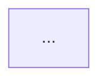

# Onboarding cache templates

Fill these four files at the project root. Keep headings. Cut a section only when the repo genuinely has nothing for it (say so in one line, e.g. "No workers; this is a library."). Every bullet earns its place with a path and a reason.

The environment is the source of truth for lookups (`package.json` scripts, `--help`, directory layout). These files are a **cache** of what looking does not cheaply confess.

---

## ARCHITECTURE.md

````markdown
# Architecture

<One or two sentences: what this system is, in the repo's own terms. If CONTEXT.md exists, use those words.>

## Map



The graph is modules/packages and runtime flow, not a file tree. Nodes are things that run or things other things talk to. Edges are "calls", "publishes", "reads", "deploys". Nested workspaces: one subgraph per inner project, or one node per package, so a later agent can see there is more than one app.

## Packages

- `<name>` (`path/`): <what it owns and who calls it>

## Runtime

How a request, job, or CLI invocation actually moves. Point at the files that implement each hop.

## Out of scope for this cache

What a later agent might assume is in-tree and is not (a host daemon, a sibling repo, a SaaS).
````

---

## ENTRYPOINTS.md

```markdown
# Entry points

Where work actually starts, and why a later agent would open that file first.

## Run here

- `<command or URL>` — <why this is the way in; path to the implementation>

## Start-here files

- `path/to/file` — <what you learn by opening it that the command name does not say>

## Surfaces

One short list, only the surfaces that exist:

- CLI:
- HTTP:
- Workers / jobs:
- Scripts (only the ones that are real **entry**s, not every file under `scripts/`):
```

---

## CONFIG.md

```markdown
# Config

How configuration is loaded, and which file wins. Point at committed examples; cache what they do not confess.

## Files

- `path` — <role: example, local overlay, secrets, generated>

## Override order

1. <lowest>
2. ...
3. <wins>

## Required vs optional

What must be set for the system to boot, vs what has a working default in code. Cite the loader (e.g. `src/.../config.py`).

## Secrets

Where secrets are supposed to live, and which committed file is the safe example. Do not copy secret values into this cache.
```

---

## GOTCHAS.md

```markdown
# Gotchas

Landmines. Unwritten convention, surprising coupling, local-vs-container traps, generated code, dual layouts. Each item: the trap, the path that proves it, what to do instead.

## Landmines

- <trap>. Evidence: `path`. Instead: <the move>.

## Layout tricks

Dual package layouts, generated trees, inner projects that look like the root.

## Local vs deployed

Host vs container hostnames, bind mounts, "works on my machine" defaults.
```

---

## What to hunt (by file)

**Architecture.** Manifest workspaces, import graphs at package boundaries, compose services, "the Python in the container talks to X on the host."

**Entry.** `[project.scripts]`, `main` modules, framework app objects, `CMD`/`ENTRYPOINT`, `if __name__ == "__main__"`, CI jobs that invoke a runner. Prefer the file a later agent should _open_, not the wrapper that only `exec`s it.

**Config.** `load_dotenv`, `os.getenv` defaults, YAML/TOML layered on env, compose `env_file`, "from a Linux devcontainer use host.docker.internal."

**Gotcha.** README warnings, comments that apologize, `.gitignore` of `.env` next to a committed `.env.example`, a logical model name that is not the provider id, tests that must not be edited, append-only logs, generated code, two READMEs in nested folders.

---

## Hunting this repo (claims-intake)

Where the evidence actually lives, so a refresh spends its reads well.

**Architecture.** `claims-intake/src/claims/`: `api/routes.py` (HTTP only, no rules), `service.py` (`POLICY_RULES`, `evaluate_notification`, `submit_notification`), `models.py` (Pydantic boundary, `extra="forbid"`), `repository.py` (in-memory store, `find_matching`), `policy_client.py` (the `PolicyClient` protocol and the stub). The layering is stated in each module docstring — quote it rather than re-deriving it. Contract section 4.1 fixes the rule order V-6, V-1, V-2, V-7, V-3, V-4, V-5.

**Entry.** `pyproject.toml` has no `[project.scripts]`; the app object is `app` in `src/claims/api/routes.py`. Cross-check the uvicorn target against the `Dockerfile` `CMD`, `claims-intake/README.md`, and `.github/workflows/checks.yaml`.

**Config.** There is no `.env`, no `.env.example`, and no compose file. Configuration is `claims-intake/.devcontainer/devcontainer.json` (`containerEnv`: `SERVICE_ENV=local`, `PYTHONDONTWRITEBYTECODE=1`; `postCreateCommand: uv sync --frozen`), `pyproject.toml` (`[tool.mypy] strict`, `files = ["src", "tests"]`; `[tool.pytest.ini_options] testpaths`), the `uv.lock` pin, and `DEFAULT_POLICY_DATA` in `policy_client.py` pointing at `data/policies.json`. Say so plainly instead of inventing an override chain.

**Gotcha.** Two `.gitignore` files (git root ignores `.worktrees/`; `claims-intake/.gitignore` ignores `.venv/` and `*.env` but keeps `!example.env`). The doubled `claims-intake/claims-intake` path. `tests/integration/test_routes.py` reassigns `routes.repository` and `routes.policy_client` per test, so a global stub leaks if a test forgets. `docs/agent-log.md` records decisions already litigated — read it before proposing one of them again.
